<picture>
  <source media="(prefers-color-scheme: dark)" srcset="assets/header-dark.svg">
  
</picture>

<p align="center">
  <a href="https://github.com/Abdelsaboor/logreef_logs"></a>
  <a href="https://github.com/Abdelsaboor?tab=repositories"></a>
  
</p>

### `$ whoami`

```yaml
name: Abdelsabour Ashraf
role: Backend Developer
studying: IT & Computer Science, Sinai University
building: LogReef (ForkedOcean) · Correspondence & Workflow System · Voice of Silence
cares_about: [clean APIs, secure auth, systems that scale]
```


### ⭐ Featured work

<p>
  <a href="https://github.com/Abdelsaboor/logreef_logs"></a>
  <a href="https://github.com/Abdelsaboor/collage"></a>
  <a href="https://github.com/Abdelsaboor/Vioce-Of-Silence_backend"></a>
  <a href="https://github.com/Abdelsaboor/mowasalahni-app"></a>
</p>

<details>
<summary><b>What went into LogReef</b></summary>
<br>

- A Rust agent that tails log files and ships them over HTTPS with an API key
- Ingestion, log search and volume charts, with alert rules and notifications
- API keys you can issue and revoke, plans and billing through Polar, and auth on Supabase
- Started as a Rust service on Axum, SQLx and Redis ([first version](https://github.com/Abdelsaboor/logreef)); shipped with Docker and CI

</details>

<details>
<summary><b>What went into the Correspondence System</b></summary>
<br>

- Hasura GraphQL in front of PostgreSQL, with a NestJS actions server for the logic Hasura cannot express
- A workflow engine with transaction numbering, role-based access control and JWT auth
- A BullMQ worker for file processing, notifications, reports and statistics; files in MinIO, caching in Redis
- Prisma migrations, Swagger docs, and Docker Compose for development and production

</details>

<details>
<summary><b>What went into Voice of Silence</b></summary>
<br>

- Express and TypeScript API with Prisma: users, devices and sessions, validated with Zod
- Realtime device and session updates over Socket.IO; JWT auth and hashed passwords
- A [cinematic launch site](https://github.com/Abdelsaboor/front) in React, three.js and GSAP with scroll-driven camera moves

</details>


### 🧰 Tools I build with

<p align="center">
  <picture>
    <source media="(prefers-color-scheme: dark)" srcset="https://skillicons.dev/icons?i=nodejs%2Cts%2Cnestjs%2Cexpress%2Crust%2Cgo%2Ccs%2Cdotnet%2Cprisma%2Cpostgres%2Credis%2Cmongodb&theme=dark&perline=12">
    
  </picture>
  <br>
  <picture>
    <source media="(prefers-color-scheme: dark)" srcset="https://skillicons.dev/icons?i=docker%2Csupabase%2Cnextjs%2Creact%2Cthreejs%2Ctailwind%2Cgit%2Cgithub%2Cgithubactions%2Clinux%2Cvscode%2Cpostman&theme=dark&perline=12">
    
  </picture>
</p>


### 🐍 Contributions

<picture>
  <source media="(prefers-color-scheme: dark)" srcset="https://raw.githubusercontent.com/Abdelsaboor/Abdelsaboor/output/snake-dark.svg">
  
</picture>

### 📫 Get in touch

<p>
  <a href="https://github.com/Abdelsaboor"></a>
</p>
